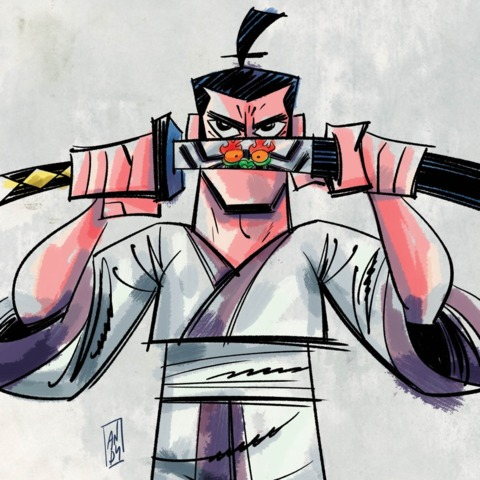
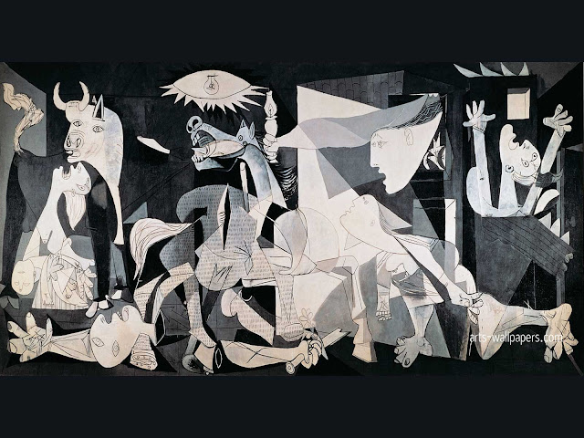
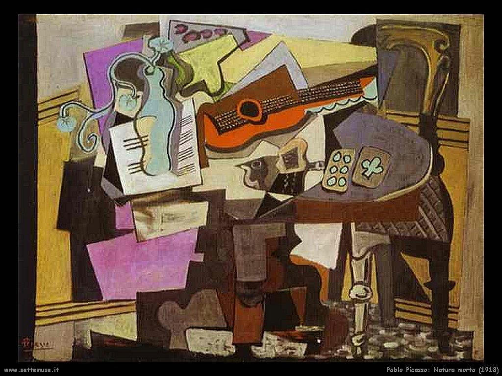

<h1 align="center"> Welcome to  LuizRio's Portal </h1>

 

 <h4>  LuizRio |🔭 Studyng program lenguages | HTML5 CSS3 and Python Enthusiast |  Bologna, Italy </h4>

 

<h2 font-size:42px align="center">**𝖑𝖊𝖓𝖌𝖚𝖆𝖌𝖊𝖘:**</h2>

   
  <a href="https://www.w3schools.com/css/" target="_blank" rel="noreferrer"> 
     
  
   

  
 
 <h2 font-size:42px align="center">**𝖕𝖎𝖈𝖆𝖘𝖘𝖔 𝖋𝖆𝖓:**</h2>
<h2 align="center">
  
 

  </h2

 
 

 
